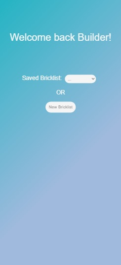
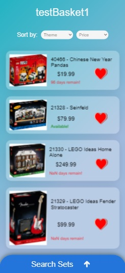
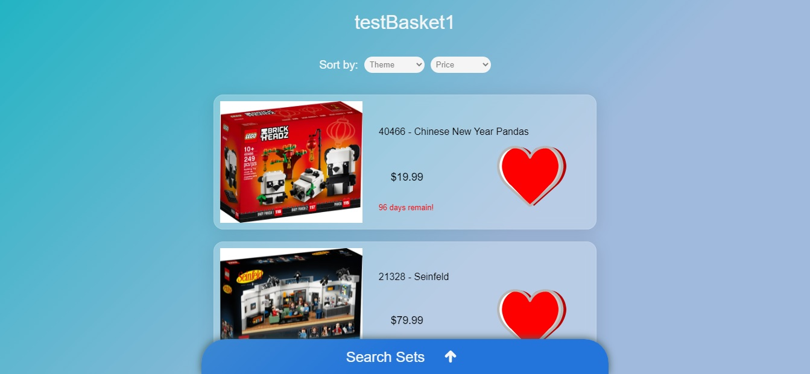
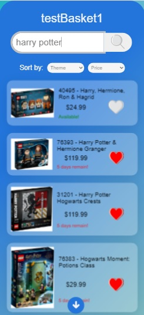
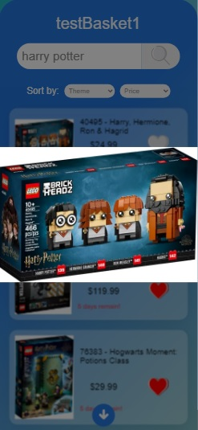
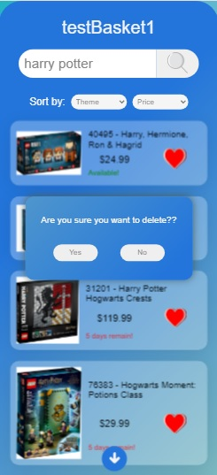
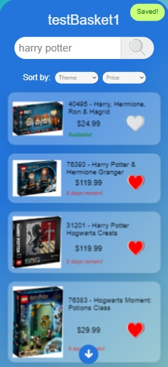

# Bricklist!!!
### GitHub Pages link - https://avast-ye-matey.github.io/bricklist/ 
### Try on either Mobile or PC - (currently designed for mobile with minor visual media queries for PC)
#### Please don't skip the [Important note](https://github.com/avast-ye-matey/bricklist#importantnote) section!
  

# Table of Contents  

[About](https://github.com/avast-ye-matey/bricklist#about) 
[Using this app](https://github.com/avast-ye-matey/bricklist#whatdoesthisprogramdo) 
-- [Visual walkthrough](https://github.com/avast-ye-matey/bricklist#visualwalkthrough) 
[Important note](https://github.com/avast-ye-matey/bricklist#importantnote) 
[Project Requirements](https://github.com/avast-ye-matey/bricklist#projectrequirements) 
-- [Feature List Items Used](https://github.com/avast-ye-matey/bricklist#featurelistitemsused) 
[Future Features](https://github.com/avast-ye-matey/bricklist#futurefeatures)  

## About 
Create and save a LEGO wishlist a.k.a Bricklist!  

## Using this app 
This version's homepage acts as if a user has just signed in. The app welcomes the user back and has them pick between two options: pick a saved Bricklist or create a new one. The saved Bricklist option has a dropdown for saved Bricklists. The create new Bricklist option provides a place to enter in the new Bricklist name.  

If the user picks a saved Bricklist, the new landing page is the Bricklist page with all the sets from that Bricklist. You can scroll through them (choosing to view by theme or price), delete them off your Bricklist, or use the tab at the bottom of the screen to bring up the Search Sets Drawer.  

If the user picks create new Bricklist and chooses a name, the new landing page is the Search Sets Drawer, skipping a blank new Bricklist page. Once the drawer is present, the user can search for LEGO sets to save to their Bricklist. The user can filter
the results with theme and price. They can also add and delete sets from the Bricklist right from the Search Set Drawer.  

Throughout this process, if any set is added or deleted, the Bricklist is autosaved. If any set is going to be deleted, there is a warning popup. 
Also at any time, the user can click on the set thumbnail to make image expand full screen and clicking again will minimize it back to regular size. 

### Visual walkthrough  

1) Mobile view of Homepage/Landing page 

	
2) Mobile view of Bricklist 

Desktop view of Bricklist 
 
	
3) Example of the search drawer 
 
	
4) Example of expanding the items image 
 

5) Example of a popup for deleting items from the Bricklist 
 

6) Example of the save popup in top right of viewport 
  

         

## Important note 
<blockquote>
I had to create a list of items for testing purposes. Currently this is the full list of items you can search for in the app.   
	
40495 - Harry, Hermione, Ron & Hagrid 
40466 - Chinese New Year Pandas 
21328 - Seinfeld 
21330 - LEGO Ideas Home Alone 
21329 - LEGO Ideas Fender Stratocaster 
40456 - Mickey Mouse 
43202 - The Madrigal House 
43197 - The Ice Castle 
76393 - Harry Potter & Hermione Granger 
31201 - Harry Potter Hogwarts Crests 
76383 - Hogwarts Moment: Potions Class 
76382 - Hogwarts Moment: Transfiguration Class  
	
**!!! If site is broken... !!!** 
I use getpantry.cloud to store my API JSON information. They use to have a auto delete date but while making this project they changed the layout of their site. I don't see a date anymore. Unfortunately I can't predict how long this will say up. Hopefully I can transfer this info to a server/database I own. If project is broken, sorry. 
</blockquote>   

## Project Requirements 
1) ✅ Your application must have a responsive design through the use of media queries, CSS Grid, Flexbox, and/or other similar approaches. 
 
2) ✅ Project is uploaded to your GitHub repository and shows at minimum 5 separate commits.       

3) ✅ Project includes a README file that explains the following:
      - A one paragraph or longer description of what your project is about.
      - Relevant packages that need installed to run the project.
      - Which 3+ features you have included from the below lists to meet the requirements
      - Any special instructions required for the reviewer to run your project. 

4) ✅ Choose at least 3 items on the Features List and implement them in your project
      - We recommend you pick a 4th item (or more!) to add, just in case something goes wrong with one of your other items - 3 is only the minimum requirement   
      
 

### Feature List Items Used   
(I posted one example for each of the following inside my JavaScript code. CTRL+F in JavaScript file and search for "// feature list item" to find code faster)
1) Read and parse an external file (such as JSON or CSV) into your application and display some data from that in your app. *I use JSON data to store my set information. The app retrieves that info to build the set layout.*
2) Retrieve data from an external API and display data in your app (such as with fetch() or with AJAX). *The ap uses fetch() to retrieve JSON data then uses that data to build the set layout.*
3) Post to an external API and show that it has saved/persisted. *Various parts of the app auto saves the updated data. There is a save icon that appears to show this. Another way to check if it was updated is start the app over to and click on the Bricklist again. It fetches the live data and will match the changes you previously made.*
4) Create an array, dictionary or list, populate it with multiple values, retrieve at least one value, and use or display it in your application. *I use an array to build an updated list to compare the main page and the drawer to know what sets should be displayed. I also build a dictionary to store the updated JSON data.*
5) Calculate and display data based on an external factor (ex: get the current date, and display how many days remaining until some event). *The app retrieves the release date of a set and the current date of the users computer and compares the two to display how many days until release or if set is already available.*
6) Create and use a function that accepts two or more values (parameters), calculates or determines a new value based on those inputs, and returns a new value. *The app uses JSON data and an array for a set creation function. It builds innerHTML and HTML elements based on those two values and returns the new set element and its internal details. At same time appends it to the parent div.*

## Future Features 
1) Make a Flutter version.
2) Flesh out the UI and include a full app starting from login.
3) Add a more in-depth release calendar. 
4) Create and use this on a framework and personal server. 
5) Change name of list.
6) WCAG compliant.
7) Add the entire LEGO iventory to search from. 
8) Transfer API JSON data to a personal web server/database. 
